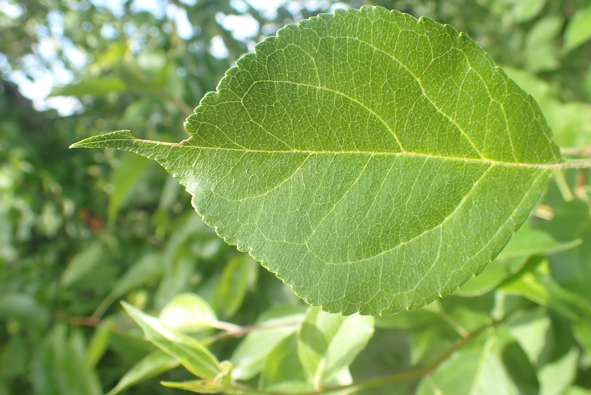
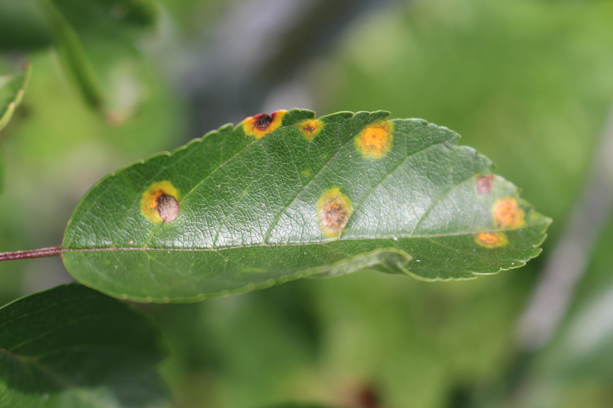
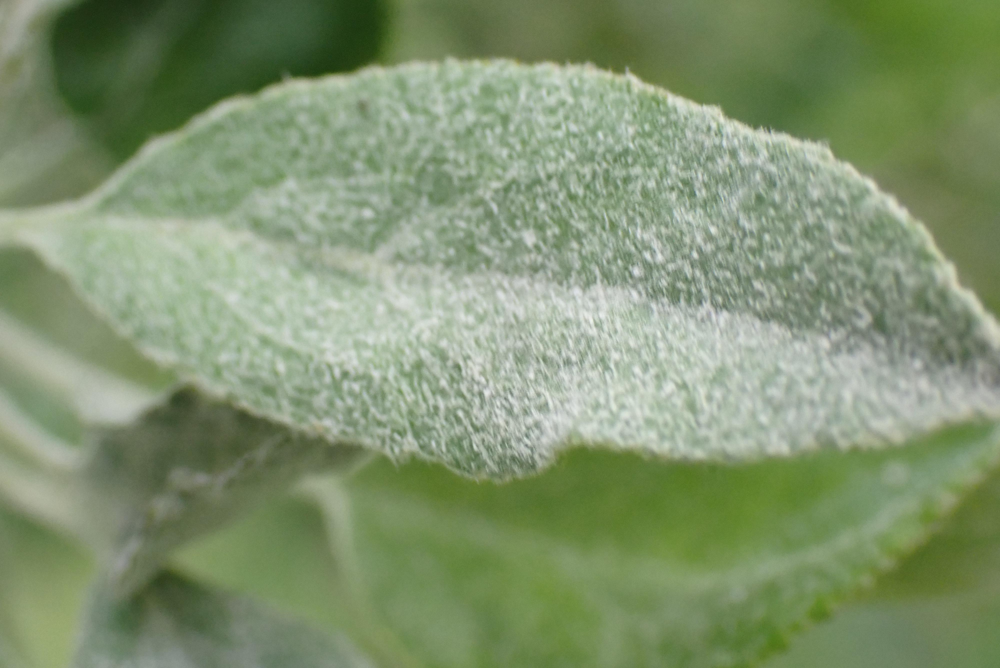

# Plant Foliage Disease Classifier

The aim of this model is to classify pictures of foliage into three categories: healthy, powdery, and rust.  
To achieve this, a neural network has been built and trained using <b>TensorFlow</b> tools. Although the current model covers only a limited number of diseases, it provides an excellent starting point for becoming familiar with these tools. Future updates will include additional features and more versatile models.

For deployment, the model is served through an API built with <b>Flask</b>. This simple web application allows users to upload a picture and determine whether the foliage is healthy or affected by one of two fungal diseases: 
<a href="https://en.wikipedia.org/wiki/Powdery_mildew">powdery mildew</a> or <a href="https://en.wikipedia.org/wiki/Rust_(fungus)">rust</a>. It is worth noting that the application can be run either locally or on <b>Google Colab</b>; however, the latter requires <b>Ngrok</b>. 

## The Dataset

The dataset can be found on <b>Kaggle</b> at the following link: 
<a href="https://www.kaggle.com/datasets/rashikrahmanpritom/plant-disease-recognition-dataset/data">
https://www.kaggle.com/datasets/rashikrahmanpritom/plant-disease-recognition-dataset/data
</a>

This dataset is organized into three main folders: <strong>Test</strong>, <strong>Train</strong>, and <strong>Validation</strong>. Each of these folders contains three subfolders —<strong>Healthy</strong>, <strong>Powdery</strong>, and <strong>Rust</strong>— where the images are already classified according to foliage health.

### Healthy

### Rusty

### Powdery

## Table of Contents

To train the model and create the necessary files (e.g., <code>model.h5</code> or <code>model.keras</code>), use the Jupyter notebook <code>Model_Training.ipynb</code>. For this task, it is recommended to work in Google Colab to avoid potential GPU issues.  
In case you prefer to skip training and use an existing model, you can download the preprocessed model from this <a href="https://drive.google.com/drive/folders/1GzNbkE-13JhHx-l9I2FEIs2AM0kRA--i?usp=drive_link">link</a>. Please note that <code>model.h5</code> shows better compatibility across environments.

The front-end files —HTML, JavaScript, and CSS— are organized within the <code>templates</code> and <code>static</code> folders.

To run the API with Flask, choose one of the following options:

<ul>
  <li><code>app.py</code>: serves the model locally.</li>
  <li><code>app.ipynb</code>: serves the model in Google Colab (requires an Ngrok account).</li>
</ul>

  The following files are used to build the image in <b>Docker</b>: 
  <code>requirements.txt</code>, <code>Dockerfile</code>, and <code>.dockerignore</code>.

Last but not least, <code>macOS-spec-file.txt</code> and <code>Win-spec-file.txt</code> can be used to create a compatible <b>Conda</b> environment.

## How to Install and Run

### Conda Enviroment

#### Windows:

To run the Flask application, you can use <code>Win-spec-file.txt</code> to create the appropriate environment on Windows: 
<code>conda create --name myenv --file Win-spec-file.txt</code>

#### Mac:

Similarly, you can use <code>macOS-spec-file.txt</code> to create a suitable environment on macOS: 
<code>conda create --name myenv --file macOS-spec-file.txt</code>

### Docker

The following files should be implemented to build the Docker image: <code>requirements.txt</code>, <code>Dockerfile</code>, and <code>.dockerignore</code>.
Build the image:  
<code> docker build -t flask-app . </code>

Then, run the app using:  
<code> docker run --name my-flask-server -p 8000:8000 flask-app </code>

## Credits

Please note that this project is based on a pre-existing one: 
<a href="https://github.com/Chando0185/plant_disease_detection">https://github.com/Chando0185/plant_disease_detection
</a>

